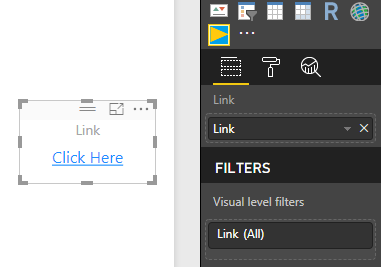
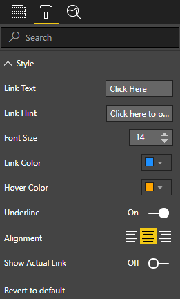

# Link Card
link card is a Custom Visual For Power BI provides you with a clickable link that could be dynamically changed depending on the user interaction with other report visuals



# Properties 

# How to Use
you could download the [.pbiviz file](dist/linkCard.pbiviz) or [build it](#how-to-build) ,then import this file into power bi.

# How to Build
to build this visual you need the following :
* [PowerBI-visuals-tools](https://github.com/Microsoft/PowerBI-visuals-tools) .

```
// install PowerBI Visuals Tools
npm install -g powerbi-visuals-tools
```

* clone/download this repo.
* install the required node-modules
```
// note that you need to execute this inside the main folder of the project.
npm update
```
* package the visual
```
pbiviz package
```

# License
this project deployed under [MIT License](LICENSE)

